**QUESTION 1**: Connect to the target machine using SSH to the port TCP/2222 and the provided credentials. Read the flag in David's home directory.

Connecting via ssh

```
ssh david@inlanefreight.htb@<IP> -p 2222
```

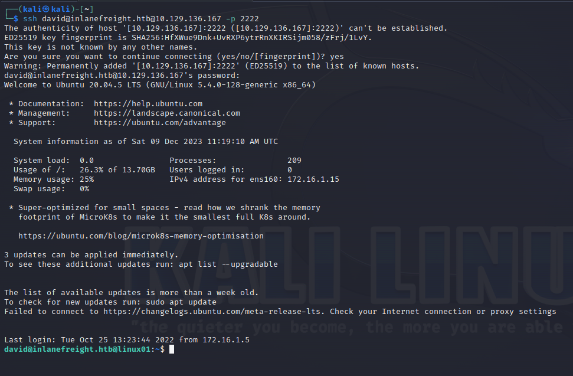  

Once connected we will see the flag in the home directory  
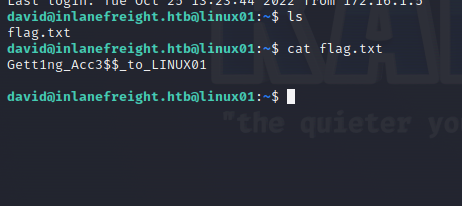

Answer: **Gett1ng\_Acc3$$\_to\_LINUX01**
____

**QUESTION 2**: Which group can connect to LINUX01?

In this question we will need to use the `realm list` command.
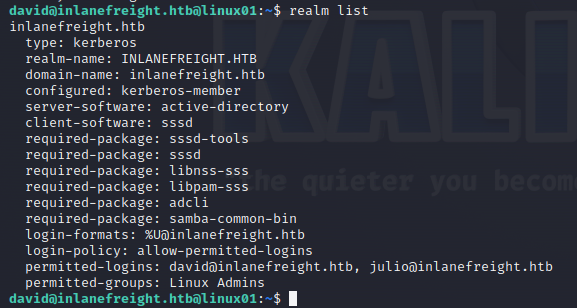

On the last line, we can see `permitted-groups: Linux Admins`

Answer: **Linux Admins**
____

**QUESTION 3**: Look for a keytab file that you have read and write access. Submit the file name as a response.

We can use the following command to find keytab files
```
find / -name *.keytab -type f 2>/dev/null
```
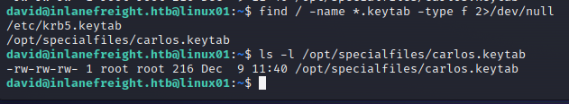

We can see that we have read and write access to carlos's keytab file.
Answer: **carlos.keytab**
____

**QUESTION 4**: Extract the hashes from the keytab file you found, crack the password, log in as the user and submit the flag in the user's home directory.

#### Extracting the hashes
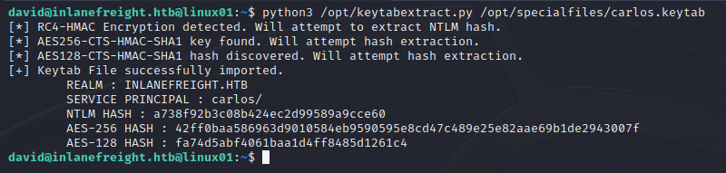

#### Cracking the password
We can crack the password using [Crackstation](https://crackstation.net).
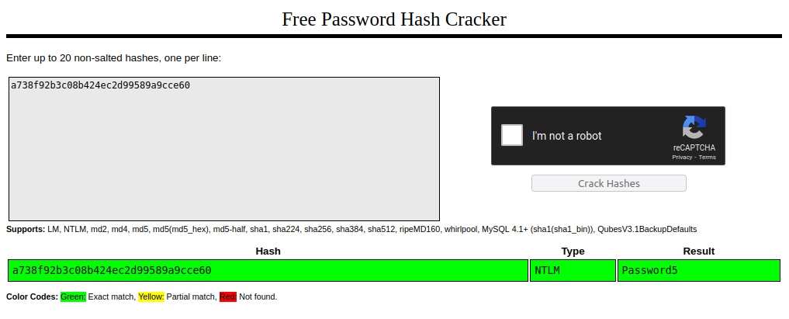

We can see that the password is `Password5`
#### Loging in as the user and submitting the flag
We can use the `su` command to switch to carlos using the previously cracked password
```
su carlos@inlanefreight.htb
```
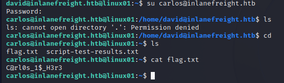

Answer: **C@rl0s_1$_H3r3**
____

**QUESTION 5**: Check Carlos' crontab, and look for keytabs to which Carlos has access. Try to get the credentials of the user svc\_workstations and use them to authenticate via SSH. Submit the flag.txt in svc\_workstations' home directory.

#### Carlos' crontab
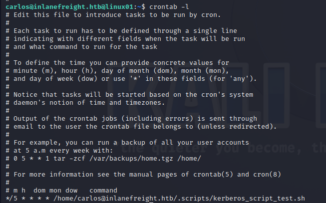

Looking at carlos' crontab we can see a cronjob using a script called kerberos_script_test.sh. Let's see its content

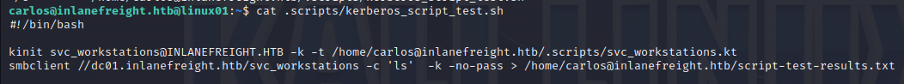

We can see that the script uses `kinit` to import the kerberos ticket `svc_workstation.kt`(located in .scripts directory), and then it connects to a shared folder via smbclient.
Looking at the content of the .scripts directory, we can see 2 files: `svc_workstations._all.kt` and `svc_workstations.kt`.
Let's use `keytabextract` on `svc_workstations._all.kt`
``` bash
python3 /opt/keytabextract.py .scripts/svc_workstations._all.kt
```
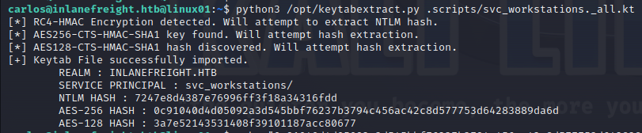

We can try to crack the ntlm hash with [Crackstation](https://crackstation.net).
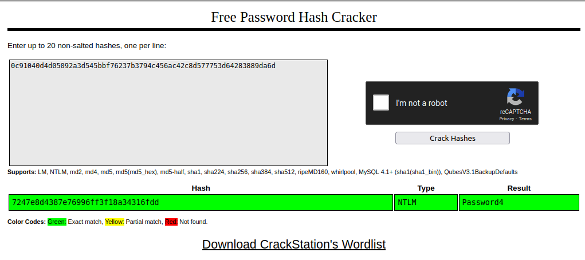

As we can see, the password is `Password4`.
We can now ssh as `svc_workstations` and retrieve the flag in the home directory
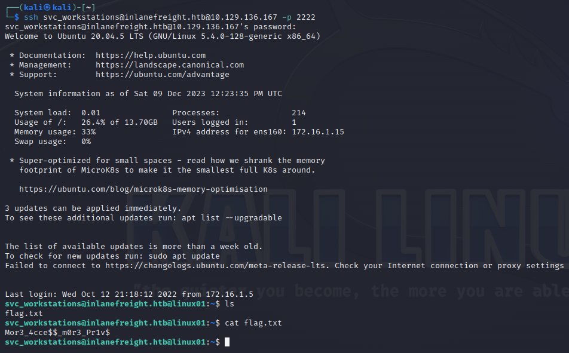

Answer: **Mor3_4cce\$\$_m0r3_Pr1v$**
____

**QUESTION 6**: Check svc\_workstation's sudo privileges and get access as root. Submit the flag in /root/flag.txt directory as the response.

After checking the sudo privileges with `sudo -l`, we can see that we can execute all command as sudo.
Now we just to switch to root with `sudo su` and retrieve the flag.

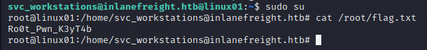

Answer: **Ro0t_Pwn_K3yT4b**

**QUESTION 7**: Check the /tmp directory and find Julio's Kerberos ticket (ccache file). Import the ticket and read the contents of julio.txt from the domain share folder \\DC01\\julio.

#### Content of the /tmp directory
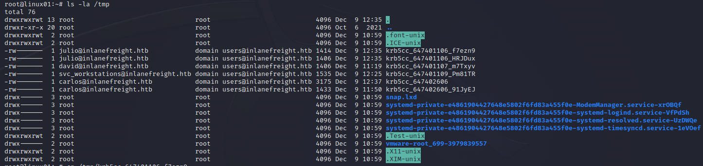

Now we just need to export julio's ccache file to the `KRB5CCNAME` environment variable, and we will be able to access the `\\DC01\julio` share.
```
export KRB5CCNAME=<path_to_ccache>
```

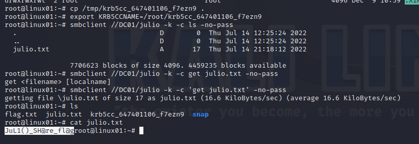

Answer: **JuL1()_SH@re_fl@g**
____

**QUESTION 8**: Use the LINUX01$ Kerberos ticket to read the flag found in \\DC01\\linux01. Submit the contents as your response (the flag starts with Us1nG\_).

In this question we need to import the keytab file of LINUX01$ which is `/etc/krb5.keytab` using kinit
```
kinit LINUX01$ -k -t /etc/krb5.keytab
```
Once imported, we can access the `\\DC01\linux01` share.
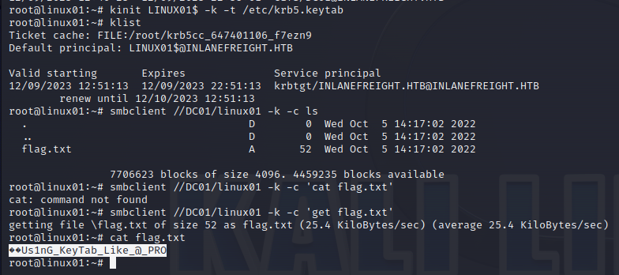

Answer: **Us1nG_KeyTab_Like_@_PRO**