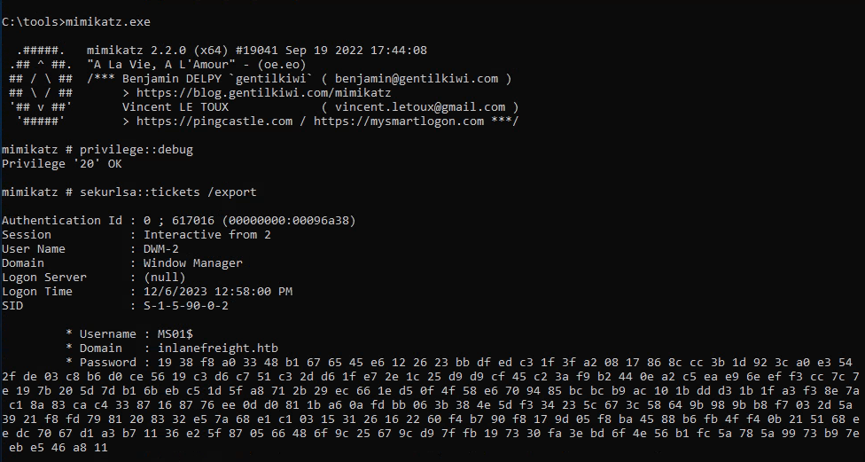
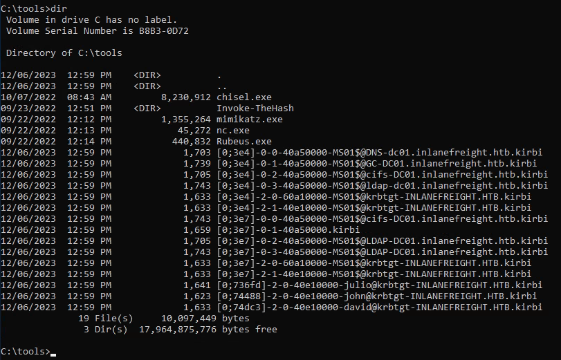
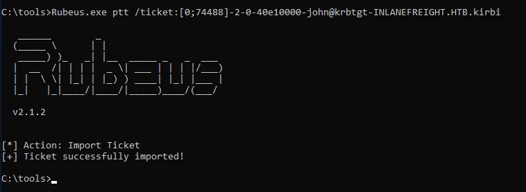
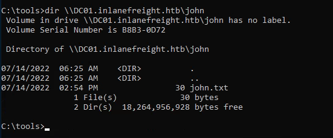
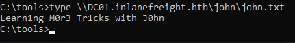
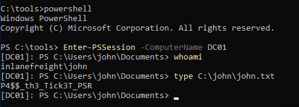

**QUESTION 1** : Connect to the target machine using RDP and the provided creds. Export all tickets present on the computer. How many users TGT did you collect? 

Connecting to the target using xfreerdp
``` bash
xfreerdp /u:Administrator /v:10.129.204.23 /p:'AnotherC0mplexP4$$'
```
Once connected, we need to start mimikatz.exe (which is located in `C:\tools`). 
In mimikatz we execute the command `privilege::debug` then we export the tickets with the command `sekurlsa::tickets /export` as shown in the picture below.



After this finishes, we can exit mimikatz with `exit` and list our current directory with the command `dir`, we should see several kirbi files



The question is asking "How many users TGT did you collect?". In the screenshot above we can see that there are 3 users' TGT (julio, john and david).

Answer: 3
____

**QUESTION 2**: Use john's TGT to perform a Pass the Ticket attack and retrieve the flag from the shared folder \\DC01.inlanefreight.htb\john

Let's use Rubeus for this one.
First we will need to import john's ticket into our session. We can do that with the following command:
```
Rubeus.exe ptt /ticket:<JOHN_TICKET.kirbi>
```

We can see that the ticket has been successfully imported.
Now we should be able to list the content of the shared folder `\\DC01.inlanefreight.htb\john`



Now we just need to display the flag `john.txt` with the following command:
```
type \\DC01.inlanefreight.htb\john\john.txt
```



Answer: Learn1ng_M0r3_Tr1cks_with_J0hn
____

**QUESTION 3**: Use john's TGT to perform a Pass the Ticket attack and connect to the DC01 using PowerShell Remoting. Read the flag from C:\john\john.txt 

In *QUESTION 2* we already imported the TGT of john into our session, so now what we need to do is open a powershell command prompt and execute the following command in order to connect to DC01
```
Enter-PSSession -ComputerName DC01
```
Once in DC01, we can retrieve the flag from `C:\john\john.txt`


Answer: P4$$_th3_Tick3T_PSR