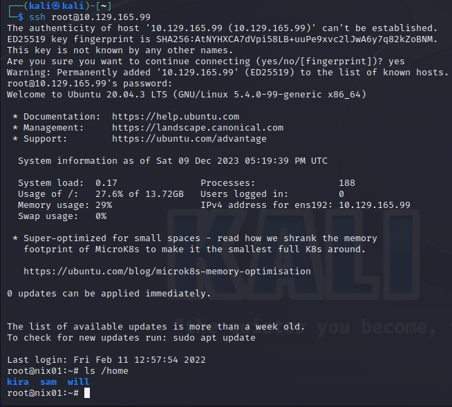
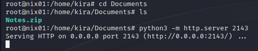
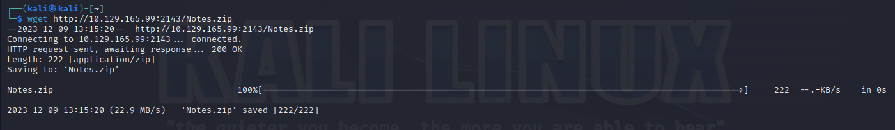
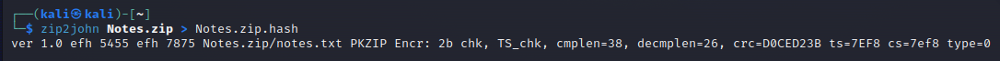
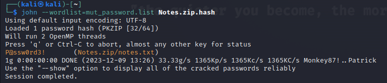
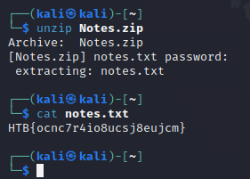

**QUESTION 1**: Use the cracked password of the user Kira, log in to the host, and read the Notes.zip file containing the flag. Then, submit the flag as the answer. 

We already have the root credentials from the `Passwd, Shadow & Opasswd` section. We can use it to ssh into the box.
Password: J0rd@n5



The `Notes.zip` file is located in `/home/kira/Documents`. 
Let's set up a python http server and transfer the archive to our attack host

#### Setting up the server


#### Downloading the file


Now that we have the archive, let's convert it with `zip2john`

``` bash
zip2john Notes.zip > Notes.zip.hash
```



Now we can use `john` to crack it

>We will use the wordlist we generated in the `Password Mutations` section

``` bash
john --wordlist=mut_password.list Notes.zip.hash
```



From here we can get the flag



Answer: **HTB{ocnc7r4io8ucsj8eujcm}**