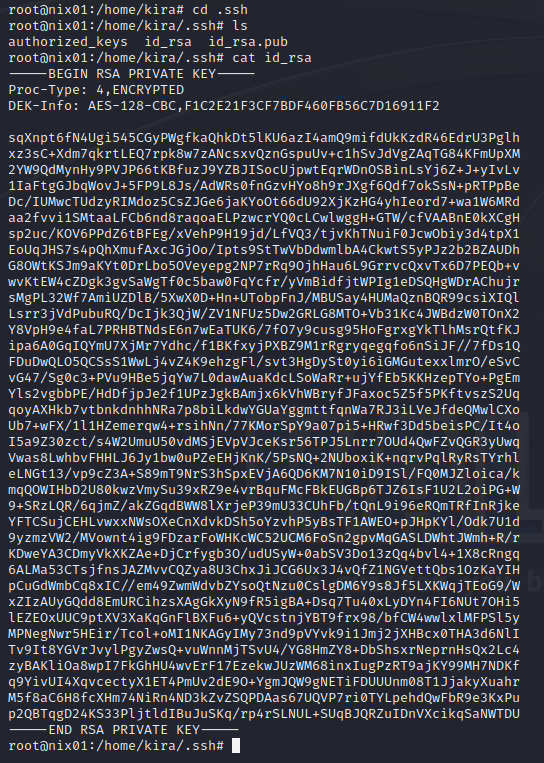
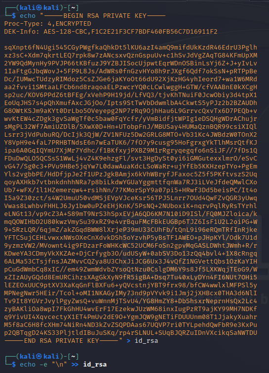
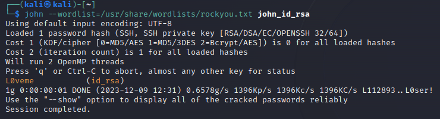

**QUESTION 1**: Use the cracked password of the user Kira and log in to the host and crack the "id\_rsa" SSH key. Then, submit the password for the SSH key as the answer.

We already have the root credentials from the `Passwd, Shadow & Opasswd` section. We can use it to ssh into the box.
Password: J0rd@n5


We can now go in `/home/kira/.ssh` and copy or transfer the `id_rsa` file to our attack host.



> If you choose to directly copy and paste the content of `id_rsa`, don't forget to `\n` at the end of the file 



Now we need to convert the file with `ssh2john`

``` bash
ssh2john id_rsa > john_id_rsa
```

From here we can crack the password with john

``` bash
john --wordlist=rockyou.txt john_id_rsa
```



Answer: **L0veme**